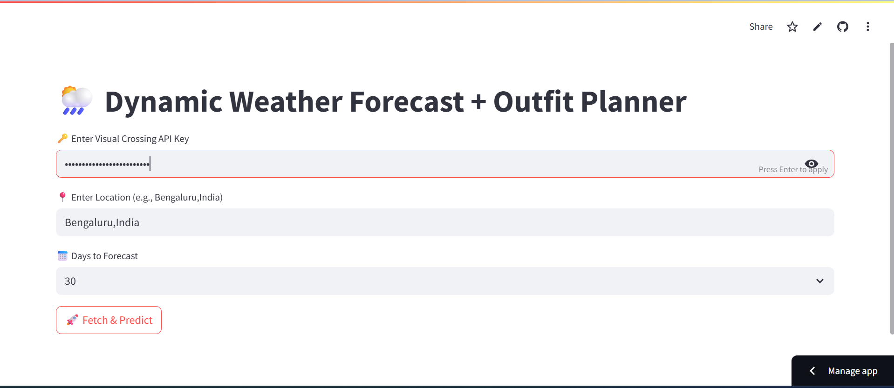
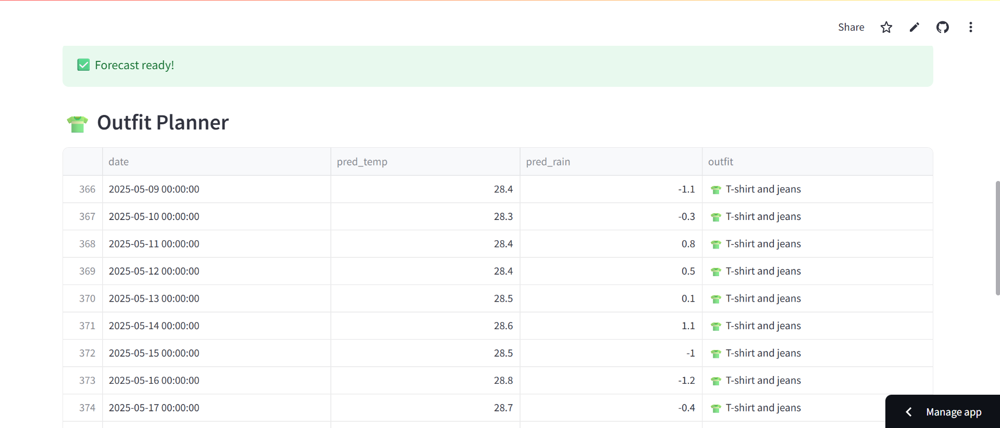
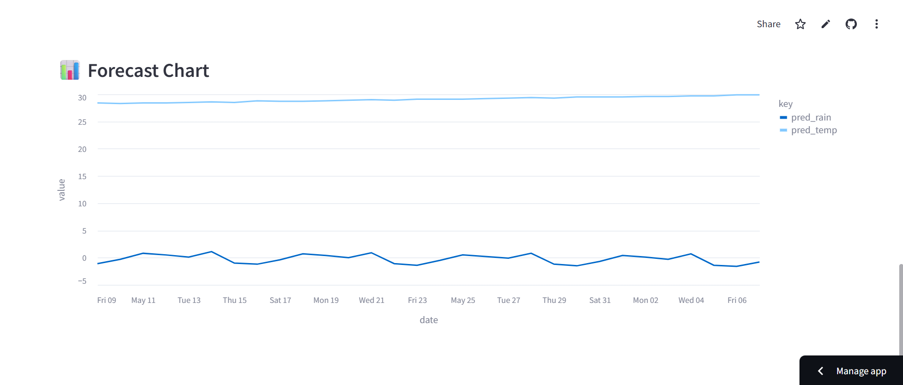

# 🌦️ Weather Forecast + Outfit Planner App

An interactive **Streamlit** web app that fetches **real-time past 1-year weather data** for your location, forecasts the next 7/14/30/60/90 days using **Prophet**, and suggests outfits (with emojis 👕🧥🩳🌧️) based on the forecast.

Built with 📊 time series forecasting models, 🔥 live weather API integration, and deployed on **Streamlit Cloud**!

---

## ✅ Features

- 🚀 **Live Weather Data** (from Visual Crossing API)
- 🤖 Uses **Prophet model** for future weather forecasting
- 👕 **Outfit suggestions** based on daily weather (smart logic + emojis)
- 📈 **Interactive charts** + neat table views
- 🌐 **Deployed on Streamlit Cloud** for public access

---

## 📝 Project Workflow

1. **Offline Analysis (CSV based)**
    - Used dataset: `Bengaluru 2021-01-01 to 2024-02-29.csv`
    - Built models:
      - `arimamodel.ipynb`
      - `sarimamodel.ipynb`
      - `prophetmodel.ipynb`
    - Compared predictions from ARIMA, SARIMA, and Prophet
    - ✅ Found **Prophet** gave best results for this weather data

2. **Live Data App (API based)**
    - Created `app.py` which:
      - Fetches **past 365 days real data** via Visual Crossing API
      - Trains **Prophet models** for temperature & rainfall
      - Predicts next **7/14/30/60/90 days**
      - Suggests outfits (e.g., 🧥 for cold, 🩳 for hot)
      - Shows results in interactive charts + tables

3. **Deployed** 🚀
    - Built the web app using **Streamlit**
    - Deployed publicly using **Streamlit Community Cloud**

---

## 🚀 Live Demo (Deployed Link)

👉 [Click Here to Try the Live App]([https://your-streamlit-cloud-link](https://real-time-weather-app-chcivn69o7hvqkyqpweauy.streamlit.app/))

---

## 📂 Folder Structure
```bash
weather-outfit-planner/
├── Bengaluru 2021-01-01 to 2024-02-29.csv   # Offline dataset used for initial experiments
├── README.md                                # Project documentation
├── app.py                                   # Streamlit web app (live forecasting)
├── arimamodel.ipynb                         # ARIMA model notebook
├── prophetmodel.ipynb                       # Prophet model notebook
├── sarimamodel.ipynb                        # SARIMA model notebook
├── requirements.txt                         # Python dependencies
```

---

## 📦 Tech Stack

- **Python** (Pandas, Numpy)
- **Prophet** (Forecasting)
- **ARIMA / SARIMA** (Comparative models)
- **Visual Crossing API** (Weather data source)
- **Streamlit** (Web app framework)
- **Altair** (Interactive charts)

---

## 📸 Screenshots

### 🏠 Home Page


---

### 📊 Past Real Weather Data


---

### 🌦️ Predicted Forecast Data + Outfit Suggestions


---

### 📈 Interactive Forecast Charts



---


## 📝 How to Run This App Locally

### 1. Clone the Repo
```bash
git clone https://github.com/yourusername/weather-outfit-planner.git
cd weather-outfit-planner
```


### 2. Install Requirements
```bash
pip install -r requirements.txt
```

### 3. Get Free API Key
Sign up at Visual Crossing Weather API ✅
Copy your API key (free tier gives 1000+ calls per day)

### 4. Run the App
```bash
streamlit run app.py
```

---

## 🚧 Future Plans

🖼️ Show outfit images along with emojis

📱 Make app mobile-friendly

📅 Allow users to download weekly outfit plans

🌐 Add more cities and multiple API providers


